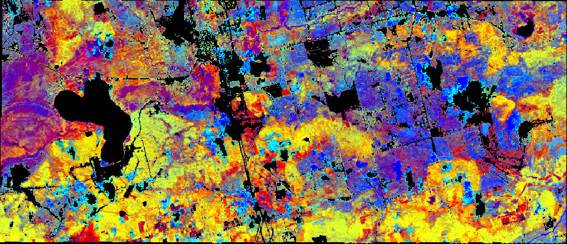

# SISTER Trait estimate PGE Documentation

## Description

The L2B trait estimate PGE takes as input a surface reflectance dataset and a fraction cover map and applies a partial least squares regression (PLSR) algorithms to generate maps of the following vegetation canopy traits:

- Chlorophyll content (ug/cm2) 
- Nitrogen concentration (g/mg)
- Leaf mass per area (g/m2)

For DESIS imagery only chlorophyll is estimated, models for nitrogen and leaf mass per area require
infrared wavelengths outside of the spectral range of DESIS.

### AVIRIS Classic vegetation trait quicklook


## PGE Arguments

In addition to required MAAP job submission arguments the L2A spectral resampling PGE also takes the following argument(s):

|Argument| Type |  Description | Default|
|---|---|---|---|
| reflectance_dataset| string |L2A reflectance dataset granule URL| -|
| frcover_dataset| string |L2B fractional cover granule URL| -|
| veg_cover| string | Minimum vegetation cover to apply algorith (0.0-1.0)| 0.5|
| crid| string | Composite release identifier| 000|

## Outputs

The outputs of the L2B vegetation trait estimate PGE use the following naming convention:

    SISTER_<SENSOR>_L2B_VEGBIOCHEM_<YYYYMMDDTHHMMSS>_<CRID>_<SUBPRODUCT>

|Product description| Units |Example filename |
|---|---|---|
| Chlorophyll COGeotiff | - | SISTER\_AVNG\_L2B\_VEGBIOCHEM\_20220502T180901\_001\_CHL.tif |
| 1. Chlorophyll content | ug/cm2 |  |
| 2. Chlorophyll content uncertainty | ug/cm2 |  |
| 3. Quality assurance mask  | - |  |
| Chlorophyll metadata | - | SISTER\_AVNG\_L2B\_VEGBIOCHEM\_20220502T180901\_001\_CHL.met.json |
| Nitrogen COGeotiff | mg/g| SISTER\_AVNG\_L2B\_VEGBIOCHEM\_20220502T180901\_001\_NIT.tif |
| 1. Nitrogen concentration | - |  |
| 2. Nitrogen concentration uncertainty | mg/g |  |
| 3. Quality assurance mask  | - |  |
| Nitrogen metadata | - | SISTER\_AVNG\_L2B\_VEGBIOCHEM\_20220502T180901\_001\_NIT.met.json |
| Leaf mass per area COGeotiff | -| SISTER\_AVNG\_L2B\_VEGBIOCHEM\_20220502T180901\_001\_LMA.tif |
| 1. Leaf mass per area | g/m2  |  |
| 2. Leaf mass per area uncertainty | g/m2  |  |
| 3. Quality assurance mask  | - |  |
| Leaf mass per area metadata | - | SISTER\_AVNG\_L2B\_VEGBIOCHEM\_20220502T180901\_001\_LMA.met.json |
| Quicklook  | - |  SISTER_AVNG\_L2A\_VEGBIOCHEM\_20220502T180901\_001.png |
| PGE runconfig| - |  SISTER\_AVNG\_L2B\_VEGBIOCHEM\_20220502T180901\_001.runconfig.json |
| PGE log| - |  SISTER\_AVNG\_L2B\_VEGBIOCHEM\_20220502T180901\_001.log |


## Algorithm registration

This algorithm can be registered using the algorirthm_config.yml file found in this repository:

	from maap.maap import MAAP
	import IPython
	
	maap = MAAP(maap_host="sister-api.imgspec.org")

	trait_estimate_alg_yaml = './sister-trait_estimate/algorithm_config.yaml'
	maap.register_algorithm_from_yaml_file(file_path= trait_estimate_alg_yaml)


## Example
	vegbiochem_job_response = maap.submitJob(
	                        algo_id="sister-trait_estimate",
	                        version="1.0.0",
	                        reflectance_dataset= 'SISTER_AVNG_L2A_RFL_20220502T180901_001',
	                        frcov_dataset= 'SISTER_AVNG_L2B_FRCOV_20220502T180901_001',
	                        veg_cover = 0.5,
	                        crid = '001'
	                        publish_to_cmr=False,
	                        cmr_metadata={},
	                        queue="sister-job_worker-16gb",
	                        identifier= 'SISTER_AVNG_L2B_VEGBIOCHEM_20220502T180901_001')
	                        
	                        
	                        
                        
                        
                        
                        
                        